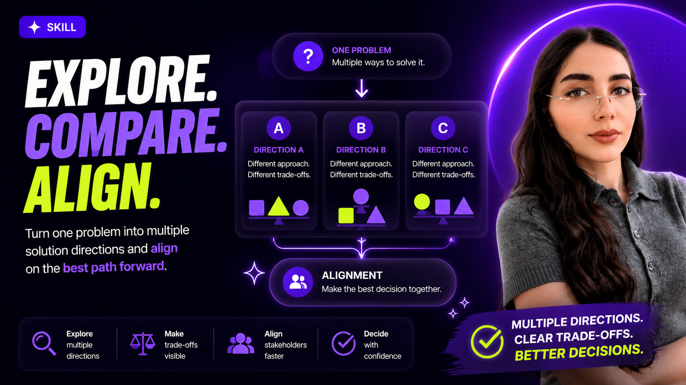

# Direction Alignment Skill



> Turn one product problem into three meaningful solution directions, visualize their trade-offs, and generate stakeholder-ready prototypes for faster alignment.

---

## Why This Exists

Many product teams move too quickly from a problem to a single solution.

A designer creates one concept.

A PM has another idea.

Engineering has concerns.

Stakeholders struggle to understand trade-offs.

The conversation becomes:

> "Do we like this solution?"

instead of:

> "Which direction should we choose and why?"

This skill helps teams explore multiple futures before committing to one.

---

## What the Skill Does

Given a product problem, the skill will:

1. Understand the problem
2. Ask clarifying questions when needed
3. Generate three distinct solution directions
4. Surface the trade-offs between them
5. Help refine the decision space
6. Generate a stakeholder comparison experience
7. Build interactive prototypes for each direction

The goal is not to find the perfect solution.

The goal is to make multiple options visible so teams can make better decisions.

---

## Example Workflow

```text
Product Problem
        ↓
Three Solution Directions
        ↓
Trade-Off Exploration
        ↓
Stakeholder Comparison
        ↓
Interactive Prototypes
        ↓
Alignment
```

---

## Example Input

```text
Use the direction-alignment-skill.

Problem:

New users struggle to create their first workflow and rarely reach activation.
```

---

## Example Output

### Direction 01 — AI Builds It For Me

Users describe their goal.

AI generates the initial workflow automatically.

**Optimizes for**

* Speed
* Time-to-value

**Sacrifices**

* Control
* Transparency

---

### Direction 02 — Start From Proven Templates

Users begin with industry-specific templates.

AI customizes the template.

**Optimizes for**

* Confidence
* Reliability

**Sacrifices**

* Flexibility

---

### Direction 03 — Guided Co-Pilot

Users build manually while AI provides suggestions.

**Optimizes for**

* Learning
* Control

**Sacrifices**

* Setup speed

---

## What Gets Generated

### Stakeholder Comparison Page

A comparison experience that:

* presents all directions equally
* makes trade-offs visible
* helps stakeholders decide what to explore

### Interactive Prototypes

One prototype per direction.

Each prototype focuses on:

* one defining product bet
* realistic product context
* realistic workflows
* realistic outcomes

The goal is to help stakeholders experience a direction rather than read about it.

---

## Design Philosophy

### One Direction = One Product Bet

Each direction should represent a meaningful strategic choice.

Not a visual variation.

Not a UI tweak.

A real product bet.

---

### Product Scenes, Not Components

Prototypes should feel like believable moments inside a product.

Not isolated components.

Not wireframes.

Not design exercises.

Stakeholders should be able to understand:

* where they are
* what they are doing
* why it matters

without requiring explanation from the designer.

---

### Alignment Over Documentation

This skill is not designed to create long discovery reports.

It is designed to help teams compare options and make decisions.

Everything should support alignment.

Nothing should distract from it.

---

## Best Use Cases

✅ New feature exploration

✅ AI-assisted product experiences

✅ Product discovery workshops

✅ Stakeholder reviews

✅ Product strategy discussions

✅ Exploring multiple UX directions

✅ Rapid prototyping before committing

---

## Not Designed For

❌ Production-ready implementation

❌ Pixel-perfect design systems

❌ Technical architecture decisions

❌ Full user journey mapping

❌ Research synthesis

---

## Example

Explore a full reference output of this skill — comparison page, three interactive prototypes, and direction documentation.

**[Run locally →](./examples/first-workflow-activation/README.md)**

```bash
cd examples/first-workflow-activation/app
npm install
npm run dev
```

Open [http://localhost:5173](http://localhost:5173)

| | |
|---|---|
| **Problem** | New users at Relay struggle to create their first workflow |
| **Direction 01** | Describe It, Relay Builds It — prompt-first generation |
| **Direction 02** | Start From Proven Templates — template gallery |
| **Direction 03** | Build With an Assistant — manual builder + suggestions |
| **Documentation** | [directions.md](./examples/first-workflow-activation/directions.md) |

After enabling GitHub Pages (Settings → Pages → GitHub Actions), the live demo URL appears in your repo's Pages settings.

---

## Installation

See:

```text
INSTALL.md
```

for step-by-step installation instructions.

---

## Repository Structure

```text
direction-alignment-skill/
├── README.md
├── INSTALL.md
├── LICENSE
├── SKILL.md
├── examples/
│   └── first-workflow-activation/
│       ├── README.md
│       ├── directions.md
│       └── app/                 # runnable Vite + React demo
└── .github/workflows/           # GitHub Pages deploy
```

---

## Inspiration

This skill is inspired by modern product discovery workflows where teams explore multiple solution directions before committing to implementation.

The emphasis is on:

* trade-off visibility
* stakeholder alignment
* realistic prototype experiences
* decision-making over documentation

---

## License

MIT
